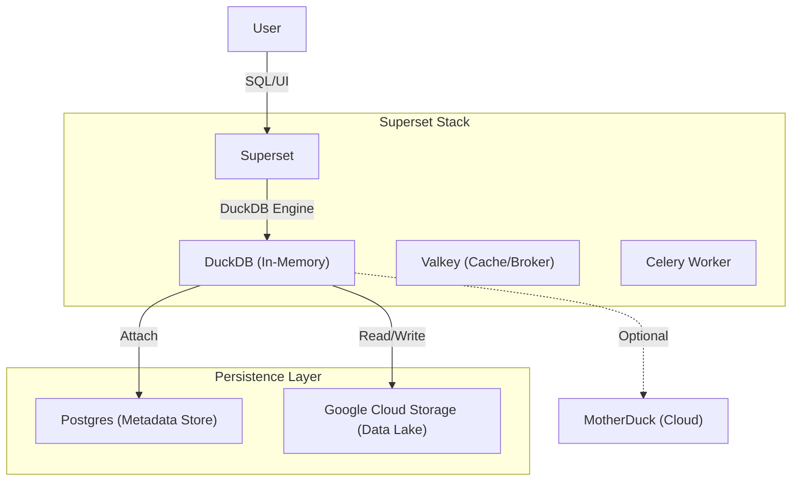

# Superset with DuckLake Integration

This repository contains a production-ready configuration for Apache Superset integrated with **DuckLake**. It enables a stateless analytics architecture where:
- **Compute**: DuckDB (running within Superset container)
- **Metadata**: PostgreSQL (persistent storage for DuckDB/DuckLake catalogs)
- **Data**: Google Cloud Storage (GCS) (parquet/iceberg files)

## Architecture



### Key Features
- **Stateless Application**: No analytic data is stored in the Superset container.
- **Persistent Metadata**: DuckLake catalogs are stored in the `ducklake_analytics` PostgreSQL database.
- **Secure Credentials**: GCS credentials are managed via environment variables and persistent DuckDB secrets.
- **Scalable Architecture**: 
  - **Simple Mode**: Monolithic container for development.
  - **Production Mode**: Microservices with Async Workers, **Valkey** caching, and **Celery**.
  - **Kubernetes Ready**: Helm charts included for cloud-native deployment.
- **MotherDuck Support**: Optional integration for cloud-native scaling.

## Prerequisites

- Docker & Docker Compose
- Google Cloud Storage (GCS) Bucket and HMAC Keys (Access Key & Secret)
- (Optional) MotherDuck Token
- (Optional) Kubernetes Cluster & Helm (for K8s deployment)

## Quick Start (Simple Mode)

Ideal for development, testing, or small teams. Runs Superset as a single service without async workers.

1.  **Clone the repository**:
    ```bash
    git clone <repo-url>
    cd superset
    ```

2.  **Configure Environment**:
    Copy the example file and update it with your credentials:
    ```bash
    cp .env.example .env
    # Edit .env and set GCS_KEY_ID, GCS_SECRET, GCS_DATA_PATH
    ```

3.  **Start Services**:
    ```bash
    docker compose up -d --build
    ```

4.  **Access Superset**:
    - URL: `http://localhost:8080`
    - User: `admin` / `admin`

## Production Setup (High Performance)

Ideal for high traffic, multiple analysts, and heavy query loads. Uses **Valkey** for caching and **Celery** for asynchronous query execution.

1.  **Configure Environment**:
    Ensure `.env` is populated (same as above).

2.  **Start Services (Production Profile)**:
    ```bash
    docker compose -f docker-compose-prod.yml up -d --build
    ```

    This launches:
    - **superset**: Web server (Gunicorn with async `gevent` workers).
    - **superset-worker**: Dedicated worker for SQL execution.
    - **superset-worker-beat**: Scheduler.
    - **valkey**: High-performance cache & message broker (Redis compatible).
    - **postgres**: Metadata store.

## Kubernetes Deployment (Helm)

We provide a production-ready Helm chart in `charts/superset`.

1.  **Configure `values.yaml`**:
    Update `charts/superset/values.yaml` with your external Postgres and Redis/Valkey details.

2.  **Install Chart**:
    ```bash
    helm install superset ./charts/superset \
      --set commonLabels.environment=production
    ```

See [charts/superset/README.md](charts/superset/README.md) for detailed configuration options.

## CI/CD Pipeline

Automated workflows are configured for GitHub Actions:

- **Docker Publish**: Builds and pushes the Superset image to GHCR on new tags (e.g., `v1.0.0`).
- **Helm Release**: Packages and pushes the Helm chart to GHCR OCI registry on new tags.

To trigger a release:
```bash
git tag v1.0.0
git push origin v1.0.0
```

## Configuration

### Environment Variables (`.env`)

| Variable | Description |
|----------|-------------|
| `GCS_KEY_ID` | GCS HMAC Access Key |
| `GCS_SECRET` | GCS HMAC Secret |
| `GCS_DATA_PATH` | Base GCS URI (e.g., `gs://my-analytics-bucket/`) |
| `MOTHERDUCK_TOKEN` | (Optional) Token for MotherDuck integration |
| `SUPERSET_SECRET_KEY` | Security key (generated automatically) |

### MotherDuck Integration
To enable MotherDuck (cloud-hosted DuckDB):
1.  Add `MOTHERDUCK_TOKEN=your_token` to your `.env` file.
2.  Restart the containers.
3.  The extension will be automatically loaded on connection.

### Performance Tuning
- **Caching**: Configured in `superset_config.py` to use Valkey for query results, dashboards, and explore state.
- **Workers**: `superset-init.sh` automatically detects the environment and tunes Gunicorn workers (default: 10 async workers).

## Usage Guide

### Creating Tables (DDL)
You can create tables directly in SQL Lab. Metadata will be stored in Postgres, and data files will be written to GCS.

```sql
CREATE TABLE my_table AS SELECT * FROM 'gs://public-data/file.parquet';
```

### Handling Complex Types (STRUCT/LIST)
Superset's UI currently has limitations visualizing raw `STRUCT` or `LIST` types from DuckDB. If you encounter an error like *"An error occurred while expanding the table schema"*, follow this pattern:

**Create a View to flatten or cast complex types:**

```sql
CREATE VIEW my_view AS 
SELECT 
    id,
    name,
    CAST(complex_column AS JSON) as complex_column_json
FROM my_complex_table;
```

Then query `my_view` in Superset.

## Directory Structure

- `docker/`: Docker configuration and scripts.
  - `scripts/`: Initialization and configuration scripts.
  - `superset_config.py`: Superset Python configuration (hooks for DuckLake, Caching, Celery).
- `charts/`: Kubernetes Helm charts.
- `docker-compose.yml`: **Simple/Dev** orchestration.
- `docker-compose-prod.yml`: **Production** orchestration (Valkey, Workers).

## Troubleshooting

- **"No such file or directory" during attach**: Ensure the Postgres service is healthy and the `POSTGRES_DB` exists.
- **Async Queries Stuck**: If running in Production mode, ensure `superset-worker` is running and connected to `valkey`. Check logs: `docker logs superset_worker`.

## License & Attribution

This project is licensed under the [MIT License](LICENSE).

We deeply appreciate the open-source community. If you use this project or derive work from it, **attribution is greatly appreciated**. A simple mention or link back to this repository helps us grow and continue contributing to the ecosystem.
