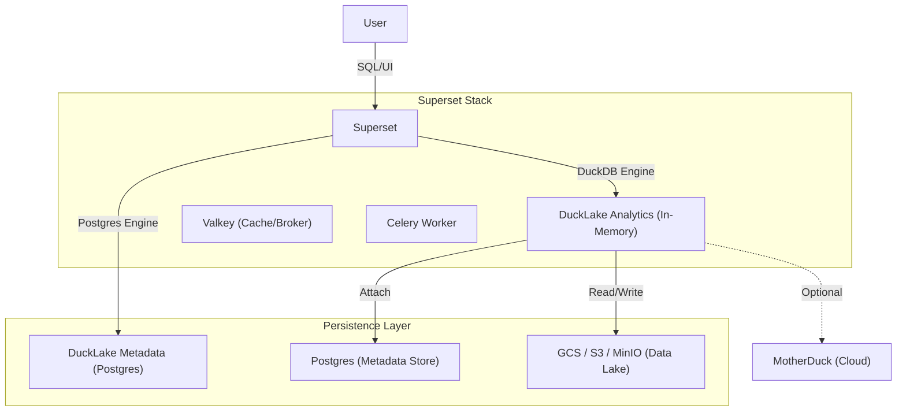

# Superset with DuckLake Integration

This repository contains a production-ready configuration for Apache Superset integrated with **DuckLake**. It enables a stateless analytics architecture where:
- **Compute**: DuckDB (running within Superset container)
- **Metadata**: PostgreSQL (persistent storage for DuckDB/DuckLake catalogs)
- **Data**: 
  - **Google Cloud Storage (GCS)**
  - **Amazon S3 / MinIO** (Any S3-compatible storage)

## Architecture



### Key Features
- **Stateless Application**: No analytic data is stored in the Superset container.
- **Persistent Metadata**: DuckLake catalogs are stored in the `ducklake_analytics` PostgreSQL database.
- **Dual Connection**:
    - **DuckLake Analytics**: The high-performance DuckDB engine for querying your data lake.
    - **DuckLake Metadata**: A direct Postgres connection to inspect your schemas, tables, and internal DuckDB metadata.
- **Multi-Cloud Support**: Connect to **GCS**, **AWS S3**, or self-hosted **MinIO** simultaneously.
- **BigQuery Integration**: Native support for querying BigQuery datasets through DuckDB BigQuery plugin (Kubernetes deployment).
- **Secure Credentials**: Credentials are managed via environment variables and persistent DuckDB secrets.
- **Scalable Architecture**: 
  - **Simple Mode**: Monolithic container for development.
  - **Production Mode**: Microservices with Async Workers, **Valkey** caching, and **Celery**.
  - **Kubernetes Ready**: Helm charts included for cloud-native deployment.
- **MotherDuck Support**: Optional integration for cloud-native scaling.

## Prerequisites

- Docker & Docker Compose
- **Data Lake Storage**:
  - Google Cloud Storage (GCS) Bucket and HMAC Keys
  - **OR** Amazon S3 / MinIO Bucket and Access Keys
- (Optional) MotherDuck Token
- (Optional) Kubernetes Cluster & Helm (for K8s deployment)

## Quick Start (Simple Mode)

Ideal for development, testing, or small teams. Runs Superset as a single service without async workers.

1.  **Clone the repository**:
    ```bash
    git clone <repo-url>
    cd superset
    ```

2.  **Configure Environment**:
    Copy the example file and update it with your credentials:
    ```bash
    cp .env.example .env
    # Edit .env and set GCS_KEY_ID/SECRET or S3_ACCESS_KEY_ID/SECRET
    ```

3.  **Start Services**:
    ```bash
    docker compose up -d --build
    ```

4.  **Access Superset**:
    - URL: `http://localhost:8080`
    - User: `admin` / `admin`

## Production Setup (High Performance)

Ideal for high traffic, multiple analysts, and heavy query loads. Uses **Valkey** for caching and **Celery** for asynchronous query execution.

1.  **Configure Environment**:
    Ensure `.env` is populated (same as above).

2.  **Start Services (Production Profile)**:
    ```bash
    docker compose -f docker-compose-prod.yml up -d --build
    ```

    This launches:
    - **superset**: Web server (Gunicorn with async `gevent` workers).
    - **superset-worker**: Dedicated worker for SQL execution.
    - **superset-worker-beat**: Scheduler.
    - **valkey**: High-performance cache & message broker (Redis compatible).
    - **postgres**: Metadata store.

## BigQuery Integration (Docker Compose)

To enable BigQuery support in your Docker Compose deployment:

1. **Place your service account JSON file** in the `secrets/` directory:
   ```bash
   cp /path/to/your-service-account.json secrets/bigquery-sa.json
   ```

2. **Update your `.env` file**:
   ```bash
   # Enable BigQuery
   BIGQUERY_ENABLED=true
   BIGQUERY_PROJECT_ID=your-gcp-project-id
   GOOGLE_APPLICATION_CREDENTIALS=/app/secrets/bigquery-sa.json
   ```

3. **Restart your containers**:
   ```bash
   docker-compose down
   docker-compose up -d
   ```

### Querying BigQuery

The BigQuery integration uses the ATTACH method, which provides access to **ALL datasets** in your project. You can query any table using:

```sql
-- Query tables from any dataset in the project
SELECT * FROM bq.dataset_name.table_name;

-- Example: Cross-dataset queries
SELECT
  a.user_id,
  b.campaign_name
FROM bq.analytics.users a
JOIN bq.marketing.campaigns b ON a.id = b.user_id;

-- Discover available datasets and tables
SHOW ALL TABLES;
```

**Note**: No dataset field is needed in the configuration. All datasets in the project are automatically accessible via the `bq.dataset_name.table_name` syntax.

For detailed setup instructions, see [`secrets/README.md`](secrets/README.md).

## Kubernetes Deployment (Helm)

We provide a production-ready Helm chart in `charts/superset`.

1.  **Configure `values.yaml`**:
    Update `charts/superset/values.yaml` with your external Postgres and Redis/Valkey details.

2.  **Install Chart**:
    ```bash
    helm install superset ./charts/superset \
      --set commonLabels.environment=production
    ```

See [`charts/superset/README.md`](charts/superset/README.md) for detailed configuration options.

### BigQuery Integration (Kubernetes)

The Helm chart includes native support for BigQuery integration through DuckDB. To enable BigQuery:

1. Create a Kubernetes secret with your GCP service account JSON
2. Configure BigQuery settings in `values.yaml`
3. Deploy the chart

For complete BigQuery configuration instructions, including security best practices and troubleshooting, see the [BigQuery Configuration section](charts/superset/README.md#bigquery-configuration) in the Helm chart README.

## CI/CD Pipeline

Automated workflows are configured for GitHub Actions:

- **Docker Publish**: Builds and pushes the Superset image to GHCR on new tags (e.g., `v1.0.0`).
- **Helm Release**: Packages and pushes the Helm chart to GHCR OCI registry on new tags.

To trigger a release:
```bash
git tag v1.0.0
git push origin v1.0.0
```

## Configuration

Configuration is managed via environment variables in `.env`.

### Storage Driver Selection
You must specify which storage backend to use for the primary `ducklake_analytics` catalog.

| Variable | Description | Default |
|----------|-------------|---------|
| `DUCKLAKE_STORAGE_DRIVER` | `gcs` or `s3` | `gcs` |

### Google Cloud Storage (GCS)
Required if `DUCKLAKE_STORAGE_DRIVER=gcs`.

| Variable | Description |
|----------|-------------|
| `GCS_KEY_ID` | GCS HMAC Access Key |
| `GCS_SECRET` | GCS HMAC Secret |
| `GCS_BUCKET_PATH` | Base GCS URI (e.g., `gs://my-analytics-bucket/`) |

### Amazon S3 / MinIO
Required if `DUCKLAKE_STORAGE_DRIVER=s3`.

| Variable | Description |
|----------|-------------|
| `S3_ACCESS_KEY_ID` | AWS/MinIO Access Key |
| `S3_SECRET_ACCESS_KEY` | AWS/MinIO Secret Key |
| `S3_BUCKET_PATH` | Base S3 URI (e.g., `s3://my-analytics-bucket/`) |
| `S3_ENDPOINT` | Custom S3 Endpoint (e.g., `minio:9000`). Leave empty for AWS. |
| `S3_REGION` | S3 Region (default: `us-east-1`) |
| `S3_URL_STYLE` | `path` (MinIO/GCS) or `vhost` (AWS) |
| `S3_USE_SSL` | `true` or `false` |

### BigQuery Configuration (Optional)

| Variable | Description | Default | Required |
|----------|-------------|---------|----------|
| `BIGQUERY_ENABLED` | Enable BigQuery support via DuckDB BigQuery plugin | `false` | No |
| `BIGQUERY_PROJECT_ID` | Your GCP project ID. All datasets in this project will be accessible | - | Yes (if enabled) |
| `GOOGLE_APPLICATION_CREDENTIALS` | Path to Google Cloud service account JSON file | `/app/secrets/bigquery-sa.json` | Yes (if enabled) |

### Other
| Variable | Description |
|----------|-------------|
| `MOTHERDUCK_TOKEN` | (Optional) Token for MotherDuck integration |
| `SUPERSET_SECRET_KEY` | Security key (generated automatically) |
| `POSTGRES_DUCKLAKE_DB` | DuckLake Metadata DB Name (default: `ducklake_analytics`) |
| `POSTGRES_DUCKLAKE_HOST` | DuckLake Metadata DB Host |
| `POSTGRES_DUCKLAKE_PORT` | DuckLake Metadata DB Port |
| `POSTGRES_DUCKLAKE_USER` | DuckLake Metadata DB User |
| `POSTGRES_DUCKLAKE_PASSWORD` | DuckLake Metadata DB Password |


### MotherDuck Integration
To enable MotherDuck (cloud-hosted DuckDB):
1.  Add `MOTHERDUCK_TOKEN=your_token` to your `.env` file.
2.  Restart the containers.
3.  The extension will be automatically loaded on connection.

### Performance Tuning
- **Caching**: Configured in `superset_config.py` to use Valkey for query results, dashboards, and explore state.
- **Workers**: `superset-init.sh` automatically detects the environment and tunes Gunicorn workers (default: 10 async workers).

## Usage Guide

### Database Connections
When you log in to Superset, you will see two pre-configured databases:
1. **DuckLake Analytics**: This is the primary engine. Use this to run SQL queries against your GCS data lake (e.g., `SELECT * FROM 'gs://...'` or querying tables created via `CREATE TABLE`).
2. **DuckLake Metadata**: This connects directly to the backend Postgres database storing the DuckDB catalog. Use this to inspect table definitions, schemas, and internal metadata if needed.

### Creating Tables (DDL)
You can create tables directly in SQL Lab using the **DuckLake Analytics** connection. Metadata will be stored in Postgres, and data files will be written to GCS.

```sql
CREATE TABLE my_table AS SELECT * FROM 'gs://public-data/file.parquet';
```

### Handling Complex Types (STRUCT/LIST)
Superset's UI currently has limitations visualizing raw `STRUCT` or `LIST` types from DuckDB. If you encounter an error like *"An error occurred while expanding the table schema"*, follow this pattern:

**Create a View to flatten or cast complex types:**

```sql
CREATE VIEW my_view AS 
SELECT 
    id,
    name,
    CAST(complex_column AS JSON) as complex_column_json
FROM my_complex_table;
```

Then query `my_view` in Superset.

## Directory Structure

- `docker/`: Docker configuration and scripts.
  - `scripts/`: Initialization and configuration scripts.
  - `superset_config.py`: Superset Python configuration (hooks for DuckLake, Caching, Celery).
- `charts/`: Kubernetes Helm charts.
- `docker-compose.yml`: **Simple/Dev** orchestration.
- `docker-compose-prod.yml`: **Production** orchestration (Valkey, Workers).

## Troubleshooting

- **"No such file or directory" during attach**: Ensure the Postgres service is healthy and the `POSTGRES_DB` exists.
- **Async Queries Stuck**: If running in Production mode, ensure `superset-worker` is running and connected to `valkey`. Check logs: `docker logs superset_worker`.

## License & Attribution

This project is licensed under the [MIT License](LICENSE).

We deeply appreciate the open-source community. If you use this project or derive work from it, **attribution is greatly appreciated**. A simple mention or link back to this repository helps us grow and continue contributing to the ecosystem.
